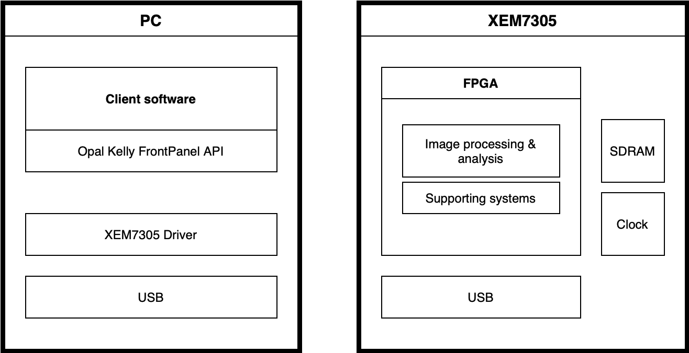
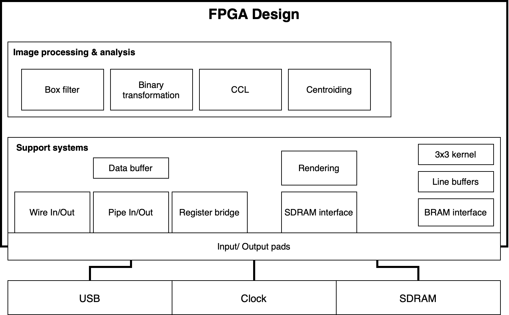

# Star tracker pre-processing pipeline - Project repository

## FPGA Design/ RTL
### IP Sources
- bram_dual_port
- fifo_w32_1024_r128_256
- fifo_w128_256_r32_1024
- ddr3_256_16

### Libraries
- Opal Kelly HDL libraries
- XEM7305 constraints

## Client/ Java application
### Requirements/ Dependencies
- Java 11
- JavaFx11
- OpalKelly Frontpanel

### Getting started - checklist
> set PATH_TO_FX="/lib/javafx-sdk-11.0.2/lib"

- compile
> javac --module-path %PATH_TO_FX% --add-modules javafx.controls -classpath okjFrontPanel.jar;nom-tam-fits-1.15.2.jar st-pp-client.java
- run
> java --module-path %PATH_TO_FX% --add-modules javafx.controls -classpath .;okjFrontPanel.jar;nom-tam-fits-1.15.2.jar st-pp-client
